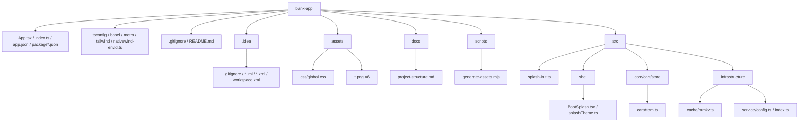

# 🚀 Expo 开发快速参考手册

## 1、常用终端指令与快捷键

| 动作           | 指令 / 快捷键                     | 备注                                  |
| :------------- | :-------------------------------- | :------------------------------------ |
| **启动项目**   | `npm expo start`                  | 开启开发服务器                        |
| **切换模拟器** | `i` / `a` / `w`                   | 分别对应 iOS / Android / Web          |
| **刷新/菜单**  | `r` (刷新) / `m` (菜单)           | `m` 可展开 Expo 开发者菜单            |
| **调试与帮助** | `j` (调试窗口) / `?` (快捷键列表) | -                                     |
| **原生预构**   | `npx expo prebuild`               | 将 JS 配置同步到 `android`/`ios` 目录 |

> **何时必须运行 `prebuild`？**
>
> - 安装了包含原生代码的库（如 `react-native-mmkv`）。
> - 修改了 `app.json` 的关键项（图标、启动图、包名、权限插件）。
> - 手动删除了 `ios` 或 `android` 原生目录需要重建时。

------

## 2、样式与 UI 方案

- **布局特性**：默认 `display: flex`，方向为 `flex-direction: column`。
- **限制**：`color` 只能写在 `<Text>` 组件上；不支持 `grid` 布局。
- **主流方案**：
  - **NativeWind (TailwindCSS)**：支持通过 `vars` 实现动态主题切换。
  - **UnoCSS**：使用 `react-native-unocss`。
  - **系统 UI 控制**：`npx expo install expo-system-ui`（常用于强制锁定浅色模式，避免商城类项目因深色模式导致 UI 混乱）。


~~~jsx
import { createMMKV } from 'react-native-mmkv'; // 注意：这里导入的是 createMMKV 函数
import { createJSONStorage } from 'jotai/utils';

// 1. 使用官方提供的工厂函数创建实例
const storageMMKV = createMMKV({
    id: 'app-store-storage', // 必须传一个 id
});

// 2. 适配 Jotai 的存储桥接
export const atomStorage = createJSONStorage<any>(() => ({
    getItem: (key: string) => {
        const value = storageMMKV.getString(key);
        return value ?? null;
    },
    setItem: (key: string, value: string) => {
        storageMMKV.set(key, value);
    },
    removeItem: (key: string) => {
        storageMMKV.remove(key);
    },
}));

/**
 * 1. 认证存储 (Auth Storage)
 * 专门存 Token、权限、登录状态
 * 拦截器直接用它
 */
export const authStorageMMKV = createMMKV({
    id: 'auth-storage', // 必须唯一
    // encryptionKey: 'some-secure-key' // 如果需要，可以单独给 Token 加密
});

export const authStorage = createJSONStorage<any>(() => ({
    getItem: (key) => authStorageMMKV.getString(key) ?? null,
    setItem: (key, value) => authStorageMMKV.set(key, value),
    removeItem: (key) => authStorageMMKV.remove(key),
}));
~~~


store

~~~jsx

import { atom } from 'jotai';
import { atomWithStorage } from 'jotai/utils';
import { withImmer } from 'jotai-immer';
import { atomStorage } from '@/infrastructure/cache/mmkv';

// 1. 实体定义
export interface CartItem {
    id: string;
    name: string;
    price: number;
    quantity: number;
    stock: number; // 模拟库存
}

// 2. 原始持久化 Atom (数据源)
// 基础数据放在 MMKV 中
const baseCartAtom = atomWithStorage<CartItem[]>('cart-storage', [], atomStorage);

// 3. 可写持久化 Immer Atom (业务操作对象)
// 使用 withImmer 包裹，让我们可以直接修改 draft
export const cartAtom = withImmer(baseCartAtom);

~~~


------

## 3、状态管理与存储及类库

| 库名             | 用途       | 特点                                             |
| :--------------- | :--------- | :----------------------------------------------- |
| **Jotai**        | 状态管理   | 配合 `atomWithStorage` 轻松实现持久化。          |
| **AsyncStorage** | 基础存储   | 传统的 Key-Value 存储，速度一般。                |
| **MMKV**         | 高性能存储 | `react-native-mmkv` 是目前 RN 最快的键值存储库。 |
| **Immer**        | 不可变数据 | 配合 `jotai-immer` 简化深层对象更新。            |

------

进阶功能支持

- **3D 渲染**：`npm install three @react-three/fiber`。
- **环境要求**：RN 0.73+ 版本强制要求 **JDK 17** 及 Android SDK。

------

## 4、打包发布 (Android)

方案 A：EAS 云端构建（官方推荐，无需本地配置环境）

1. **安装工具**：`npm install -g eas-cli`

2. **登录账号**：`eas login`

3. **配置 APK 格式**（修改 `eas.json`）：

   json

   ```
   "build": {
     "preview": { "android": { "buildType": "apk" } }
   }
   ```

   请谨慎使用此类代码。


4. **执行构建**：

   - 打测试版 APK：`eas build -p android --profile preview`
   - 打上架版 AAB：`eas build --platform android`

方案 B：本地原生构建（不依赖云端，需本地 Android 环境）

1. **生成原生目录**：`npx expo prebuild`
2. **执行打包**：
   - 方式 1：`npx expo run:android --variant release`（自动构建并尝试运行）
   - 方式 2（纯构建）：`cd android && ./gradlew assembleRelease`

------


# 项目目录结构说明

> 下列为**当前仓库内已有路径的完整树**（不含 `node_modules/`、`.git/`）。
> 若已执行 `npx expo prebuild`，本地还会多出 `android/`、`ios/` 等原生工程目录，生成后请自行补充到笔记中。

## 完整目录树（带备注）

```
bank-app/
├── App.tsx                          # 根组件：包裹 BootSplash 与业务首页
├── index.ts                         # RN 入口：先 splash-init，再 registerRootComponent(App)
├── app.json                         # Expo：名称、图标、splash、包名、插件
├── package.json                     # 依赖与 scripts（含 generate-assets）
├── package-lock.json
├── tsconfig.json                    # TS 配置；@/* → src/*
├── babel.config.ts                  # Babel：expo + NativeWind
├── metro.config.ts                  # Metro + NativeWind CSS 入口
├── tailwind.config.ts               # Tailwind / NativeWind
├── nativewind-env.d.ts              # NativeWind 类型
├── .gitignore
│
├── assets/                          # 静态资源
│   ├── css/
│   │   └── global.css               # Tailwind 全局样式入口
│   ├── android-icon-background.png
│   ├── android-icon-foreground.png
│   ├── android-icon-monochrome.png
│   ├── favicon.png
│   ├── icon.png                     # 应用图标
│   └── splash-icon.png              # 启动屏图（与 BootSplash 引用一致）
│
├── docs/
│   └── project-structure.md         # 本说明文档
│
├── scripts/
│   └── generate-assets.mjs          # 生成 assets 下各 PNG
│
└── src/
    ├── splash-init.ts               # 最早：preventAutoHideAsync
    ├── shell/                       # 启动层 / 全屏衔接
    │   ├── BootSplash.tsx
    │   └── splashTheme.ts
    ├── core/                        # 领域逻辑
    │   └── cart/
    │       └── store/
    │           └── cartAtom.ts
    └── infrastructure/            # 存储、网络、配置
        ├── cache/
        │   └── mmkv.ts
        └── service/
            ├── config.ts
            └── index.ts
```

## Typora 中可折叠的层级示意（Mermaid）

> 在 Typora 打开本文件并处于预览/渲染模式时，下图会显示为图形化层级（非逐文件列举）。



## 约定速查

| 路径 | 作用 |
|------|------|
| `src/splash-init.ts` | 须在加载 `App` 前 import，避免原生 splash 过早收起。 |
| `src/shell/` | 首屏、系统栏、启动动画，不宜混入具体商品页。 |
| `src/core/` | 按业务域划分，store / 领域规则。 |
| `src/infrastructure/` | MMKV、HTTP、环境配置等适配层。 |
| `assets/` + `scripts/generate-assets.mjs` | 改品牌资源后执行 `npm run generate-assets`，必要时 `expo prebuild` 更新原生资源。 |
| `.idea/` | 仅 IDE 使用；团队若统一用 VS Code 可加入 `.gitignore` 不提交。 |